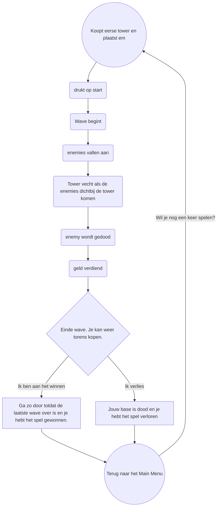

## This world is a sandbox... and you are the child. Pull the strings of heroes and villains. And most importantly...
# Happy Hunting...

BUT!

I'm if you're that one person that just scrolls through the shop at 1AM and wondering what kind of game this is... allow me to answer your questions!

# What is a Tower Defense Game?
A Tower Defense Game is a game where waves of enemies follow a path to get to your base. You'll be able to place Towers that have some kind of attack to defeat those enemies. And enemies give you money to buy more towers. But if the enemies reach your base... they'll try to destroy it! Don't let that happen or it's GAME OVER!
It works like this:

# What makes this Tower Defense Game different?
This game brings a few fun new mechanics to the mix. Want the satisfaction of wiping out an entire wave of enemies with one weapon? You've got it! Different towers and enemies! Easy! Breathtaking music? Can't fight without it! On paper you might not think much of these mechanics, but it sets the right tone without a doubt.

# A price?
It's 100% free!
