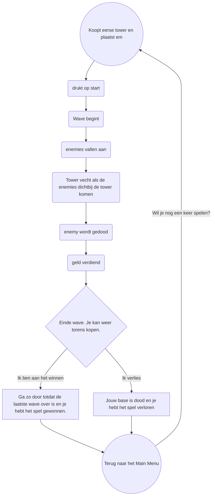

## Hi. My name is Job Heilig. I'm a student of class SD2A of the second year Software Development of the Media College. And today I'm here to present you my project. I called it:
# Happy Hunting...

I'm if you're that one person that just scrolls through the shop at 1AM and wondering what kind of game this is... allow me to answer your questions!

# What is a Tower Defense Game?
A Tower Defense Game is a game where waves of enemies follow a path to get to your base. You'll be able to place Towers that have some kind of attack to defeat those enemies. And enemies give you money to buy more towers. But if the enemies reach your base... they'll try to destroy it! Don't let that happen or it's GAME OVER!
It works like this:

# What makes this Tower Defense Game different?
This game brings a few fun new mechanics to the mix. One of the main mechanics of this game is the Nuke Ability. During your game, you'll be able to throw 2 nukes. These will wipe out any and all enemies on the field. This will also deal damage to your base. So use it carefully.

# Did you learn something from this?
Hoooooooooooooooooooooooooooooooooooooooooooooooo boy
1. Don't be emberrased to ask for help. In terms of skills and experience I am quite behind my classmates. And because of that I felt emberrased to ask for help. Which only made this project unnecesarily diffucult.
2. Use your free time to experiment. Search for guides and tutorials and keep experimenting with your game development engines and codes. Experience develops over time.
3. Don't go aiming for something too big. Always start with what you NEED instead of what you WANT.
4. Tutorials are fine, but make sure you understand it. Someone like Brackeys is cool, but I still don't understand stuff. If you don't get it, ask for help.
5. You've got time, so use it. Don't waste it on just staring at your screen. Try to learn. Try to ask.
6. Failure isn't the end. Falling and getting back up. It's a big part of the game dev journey.
